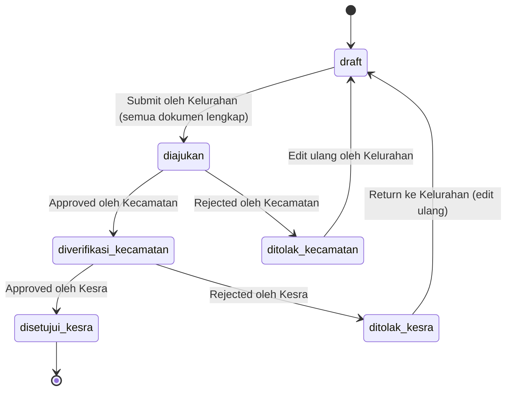

# Product Requirement Document (PRD)
# Sistem Manajemen Data Anak Yatim

**Versi:** 2.0  
**Tanggal:** September 2026  
**Product Manager:** AI Assistant  
**Tech Stack:** Laravel 13.31.0 + FilamentPHP v4 + SQLite + Spatie Laravel-Permission

---

## 1. Ringkasan Eksekutif & Tujuan Produk

### 1.1 Deskripsi Produk
Sistem Manajemen Data Anak Yatim adalah aplikasi web internal pemerintahan berbasis Laravel dengan admin panel FilamentPHP untuk menggantikan proses manual pengajuan bantuan sosial anak yatim/piatu/yatim piatu. Sistem ini mengimplementasikan workflow approval berjenjang dari Kelurahan → Kecamatan → Kesra dengan role-based access control dan isolasi data berbasis wilayah kerja.

### 1.2 Tujuan Utama
- **Digitalisasi Penuh**: Menghilangkan proses manual berbasis kertas dalam pengajuan bantuan sosial
- **Akuntabilitas & Transparansi**: Setiap perubahan status tercatat dengan audit trail lengkap
- **Keamanan Data**: Isolasi data berbasis wilayah kerja user (row-level security)
- **Efisiensi Birokrasi**: Mempercepat proses verifikasi dan approval 3 level
- **Standarisasi Dokumen**: Memastikan kelengkapan 11 jenis dokumen wajib sebelum pengajuan

### 1.3 Target Pengguna & Peran
- **Super Admin**: Mengelola master data wilayah dan user management
- **Admin Kelurahan**: Input data anak dan upload dokumen di wilayah kerjanya
- **Admin Kecamatan**: Verifikasi dan approve/reject data dari kelurahan di wilayahnya
- **Admin Kesra**: Verifikasi final dan approve/reject lintas kecamatan (approval akhir)

## 2. User Roles & Permission Matrix

### 2.1 Role-Based Access Control

| Resource / Action | Super Admin | Admin Kelurahan | Admin Kecamatan | Admin Kesra |
|-------------------|-------------|-----------------|-----------------|-------------|
| **Master Data Wilayah** | | | | |
| View Kecamatan | ✅ | ❌ | ✅ (sendiri) | ✅ |
| Create/Edit Kecamatan | ✅ | ❌ | ❌ | ❌ |
| View Kelurahan | ✅ | ✅ (sendiri) | ✅ (wilayahnya) | ✅ |
| Create/Edit Kelurahan | ✅ | ❌ | ❌ | ❌ |
| **User Management** | | | | |
| View Users | ✅ | ❌ | ❌ | ❌ |
| Create/Edit Users | ✅ | ❌ | ❌ | ❌ |
| Assign Roles | ✅ | ❌ | ❌ | ❌ |
| **Data Anak (CRUD)** | | | | |
| View Data Anak | ✅ | ✅ (kelurahan sendiri) | ✅ (status ≥ diajukan, wilayah kecamatan) | ✅ (status ≥ diverifikasi_kecamatan) |
| Create Data Anak | ✅ | ✅ | ❌ | ❌ |
| Edit Data Anak | ✅ | ✅ (status = draft/ditolak) | ❌ | ❌ |
| Delete Data Anak | ✅ | ✅ (status = draft) | ❌ | ❌ |
| **Upload Dokumen** | | | | |
| Upload Files | ✅ | ✅ (data sendiri) | ❌ | ❌ |
| Download Files | ✅ | ✅ (data sendiri) | ✅ (wilayah kecamatan) | ✅ (status ≥ diverifikasi_kecamatan) |
| **Workflow Actions** | | | | |
| Submit ke Kecamatan | ✅ | ✅ (jika dokumen lengkap) | ❌ | ❌ |
| Approve/Reject Kecamatan | ✅ | ❌ | ✅ (wilayah kecamatan) | ❌ |
| Approve/Reject Kesra | ✅ | ❌ | ❌ | ✅ |
| **Reporting & Analytics** | | | | |
| Dashboard Statistics | ✅ | ✅ (kelurahan sendiri) | ✅ (wilayah kecamatan) | ✅ (semua) |
| Export Data | ✅ | ✅ (kelurahan sendiri) | ✅ (wilayah kecamatan) | ✅ (status disetujui_kesra) |
| View Riwayat Status | ✅ | ✅ (data sendiri) | ✅ (wilayah kecamatan) | ✅ (semua) |

### 2.2 Data Isolation Rules
- **Admin Kelurahan**: Hanya akses data anak dengan `kelurahan_id = auth()->user()->kelurahan_id`
- **Admin Kecamatan**: Akses data anak dari kelurahan dalam wilayahnya: `kelurahan.kecamatan_id = auth()->user()->kecamatan_id AND status_verifikasi IN ('diajukan', 'diverifikasi_kecamatan', 'ditolak_kecamatan')`
- **Admin Kesra**: Akses data anak yang sudah lolos verifikasi kecamatan: `status_verifikasi IN ('diverifikasi_kecamatan', 'disetujui_kesra', 'ditolak_kesra')`
- **Super Admin**: Akses penuh semua data tanpa batasan wilayah

## 3. Entity Relationship Diagram (ERD)

### 3.1 Tabel Master Data

#### Tabel `kecamatan`
| Kolom | Tipe Data | Constraint | Keterangan |
|-------|-----------|------------|------------|
| id | bigint unsigned | PK, AUTO_INCREMENT | ID kecamatan |
| nama | varchar(255) | NOT NULL | Nama kecamatan |
| created_at | timestamp | NULL | Waktu dibuat |
| updated_at | timestamp | NULL | Waktu diupdate |

#### Tabel `kelurahan`
| Kolom | Tipe Data | Constraint | Keterangan |
|-------|-----------|------------|------------|
| id | bigint unsigned | PK, AUTO_INCREMENT | ID kelurahan |
| kecamatan_id | bigint unsigned | FK, NOT NULL | Referensi ke kecamatan |
| nama | varchar(255) | NOT NULL | Nama kelurahan |
| created_at | timestamp | NULL | Waktu dibuat |
| updated_at | timestamp | NULL | Waktu diupdate |

**Foreign Key**: `kelurahan.kecamatan_id` REFERENCES `kecamatan.id`

### 3.2 Tabel Users & Authentication

#### Tabel `users`
| Kolom | Tipe Data | Constraint | Keterangan |
|-------|-----------|------------|------------|
| id | bigint unsigned | PK, AUTO_INCREMENT | ID user |
| name | varchar(255) | NOT NULL | Nama lengkap user |
| email | varchar(255) | NOT NULL, UNIQUE | Email user |
| password | varchar(255) | NOT NULL | Password hash |
| kelurahan_id | bigint unsigned | FK, NULLABLE | ID kelurahan (untuk Admin Kelurahan) |
| kecamatan_id | bigint unsigned | FK, NULLABLE | ID kecamatan (untuk Admin Kecamatan) |
| email_verified_at | timestamp | NULL | Waktu verifikasi email |
| remember_token | varchar(100) | NULL | Token remember me |
| created_at | timestamp | NULL | Waktu dibuat |
| updated_at | timestamp | NULL | Waktu diupdate |

**Foreign Keys**: 
- `users.kelurahan_id` REFERENCES `kelurahan.id`
- `users.kecamatan_id` REFERENCES `kecamatan.id`

#### Tabel Spatie Permission (Generated)
- `roles`
- `permissions` 
- `model_has_permissions`
- `model_has_roles`
- `role_has_permissions`

### 3.3 Tabel Data Utama

#### Tabel `data_anak`
| Kolom | Tipe Data | Constraint | Keterangan |
|-------|-----------|------------|------------|
| id | bigint unsigned | PK, AUTO_INCREMENT | ID data anak |
| kelurahan_id | bigint unsigned | FK, NOT NULL | ID kelurahan asal |
| **Biodata Anak** | | | |
| nama_lengkap | varchar(255) | NOT NULL | Nama lengkap anak |
| nik | varchar(16) | NOT NULL, UNIQUE | NIK anak (16 digit) |
| nomor_rekening | varchar(50) | NULLABLE | Nomor rekening anak |
| tempat_lahir | varchar(255) | NOT NULL | Tempat lahir anak |
| tanggal_lahir | date | NOT NULL | Tanggal lahir anak |
| nomor_kartu_keluarga | varchar(16) | NOT NULL | Nomor KK |
| jenis_kelamin | enum('L','P') | NOT NULL | Jenis kelamin |
| status_anak | enum('yatim','piatu','yatim_piatu') | NOT NULL | Status anak |
| catatan_admin_kelurahan | text | NULLABLE | Catatan kondisi anak |
| alamat_lengkap | text | NOT NULL | Alamat lengkap |
| rt | varchar(3) | NOT NULL | RT |
| rw | varchar(3) | NOT NULL | RW |
| **Data Ayah** | | | |
| nama_ayah | varchar(255) | NOT NULL | Nama ayah kandung |
| nik_ayah | varchar(16) | NOT NULL | NIK ayah |
| pekerjaan_ayah | varchar(255) | NULLABLE | Pekerjaan ayah |
| status_hidup_ayah | enum('hidup','meninggal') | NOT NULL | Status hidup ayah |
| **Data Ibu** | | | |
| nama_ibu | varchar(255) | NOT NULL | Nama ibu kandung |
| nik_ibu | varchar(16) | NOT NULL | NIK ibu |
| pekerjaan_ibu | varchar(255) | NULLABLE | Pekerjaan ibu |
| status_hidup_ibu | enum('hidup','meninggal') | NOT NULL | Status hidup ibu |
| **Data Wali** | | | |
| nama_wali | varchar(255) | NULLABLE | Nama wali |
| hubungan_dengan_anak | varchar(100) | NULLABLE | Hubungan dengan anak |
| nik_wali | varchar(16) | NULLABLE | NIK wali |
| pekerjaan_wali | varchar(255) | NULLABLE | Pekerjaan wali |
| **Status & Tracking** | | | |
| status_verifikasi | enum('draft','diajukan','diverifikasi_kecamatan','ditolak_kecamatan','disetujui_kesra','ditolak_kesra') | DEFAULT 'draft' | Status pengajuan |
| submitted_at | timestamp | NULLABLE | Waktu submit kelurahan |
| verified_kecamatan_at | timestamp | NULLABLE | Waktu verifikasi kecamatan |
| verified_kesra_at | timestamp | NULLABLE | Waktu verifikasi kesra |
| created_by | bigint unsigned | FK, NOT NULL | User yang buat data |
| created_at | timestamp | NULL | Waktu dibuat |
| updated_at | timestamp | NULL | Waktu diupdate |

**Foreign Keys**:
- `data_anak.kelurahan_id` REFERENCES `kelurahan.id`
- `data_anak.created_by` REFERENCES `users.id`

#### Tabel `dokumen_anak`
| Kolom | Tipe Data | Constraint | Keterangan |
|-------|-----------|------------|------------|
| id | bigint unsigned | PK, AUTO_INCREMENT | ID dokumen |
| data_anak_id | bigint unsigned | FK, NOT NULL | Referensi ke data anak |
| jenis_dokumen | enum('surat_permohonan_pengajuan','surat_permohonan_pencairan','fc_ktp_orangtua_wali','fc_kartu_keluarga','fc_akte_lahir_atau_sket_lurah','fc_akte_kematian_atau_sket_lurah','surat_pernyataan_benar_anak_yatim','surat_pernyataan_kebenaran_dokumen','surat_pernyataan_tanggungjawab_bansos','fc_rekening_bank_riau_kepri_syariah','pas_foto_3x4') | NOT NULL | Jenis dokumen |
| file_path | varchar(500) | NOT NULL | Path file dokumen |
| original_filename | varchar(255) | NOT NULL | Nama file asli |
| file_size | integer | NOT NULL | Ukuran file (bytes) |
| mime_type | varchar(100) | NOT NULL | Tipe MIME file |
| uploaded_by | bigint unsigned | FK, NOT NULL | User yang upload |
| uploaded_at | timestamp | NOT NULL | Waktu upload |
| created_at | timestamp | NULL | Waktu dibuat |
| updated_at | timestamp | NULL | Waktu diupdate |

**Foreign Keys**:
- `dokumen_anak.data_anak_id` REFERENCES `data_anak.id` ON DELETE CASCADE
- `dokumen_anak.uploaded_by` REFERENCES `users.id`

**Unique Constraint**: `UNIQUE(data_anak_id, jenis_dokumen)` (satu anak hanya boleh punya satu dokumen per jenis)

#### Tabel `riwayat_status`
| Kolom | Tipe Data | Constraint | Keterangan |
|-------|-----------|------------|------------|
| id | bigint unsigned | PK, AUTO_INCREMENT | ID log |
| data_anak_id | bigint unsigned | FK, NOT NULL | Referensi ke data anak |
| status_sebelumnya | enum('draft','diajukan','diverifikasi_kecamatan','ditolak_kecamatan','disetujui_kesra','ditolak_kesra') | NULLABLE | Status sebelumnya |
| status_baru | enum('draft','diajukan','diverifikasi_kecamatan','ditolak_kecamatan','disetujui_kesra','ditolak_kesra') | NOT NULL | Status baru |
| user_id | bigint unsigned | FK, NOT NULL | User yang melakukan aksi |
| catatan | text | NULLABLE | Catatan/alasan (wajib untuk reject) |
| created_at | timestamp | NULL | Waktu perubahan status |
| updated_at | timestamp | NULL | Waktu diupdate |

**Foreign Keys**:
- `riwayat_status.data_anak_id` REFERENCES `data_anak.id` ON DELETE CASCADE
- `riwayat_status.user_id` REFERENCES `users.id`

### 3.4 Trade-off Analisis: Data Orang Tua

**Dipilih**: Kolom langsung di tabel `data_anak` (denormalized)

**Alasan**:
- ✅ **Performa Query**: Tidak butuh JOIN untuk menampilkan data anak dengan info orang tua
- ✅ **Simplicity**: Mengurangi kompleksitas relasi dan Filament Resource
- ✅ **Atomic Operations**: Insert/update data anak + orang tua dalam satu transaksi
- ❌ **Storage Redundancy**: Kolom orang tua yang sama mungkin berulang jika ada saudara kandung

**Alternatif yang Ditolak**: Tabel `orang_tua` terpisah
- ❌ **Join Complexity**: Setiap query data anak butuh JOIN ke tabel orang_tua
- ❌ **Filament Overhead**: Butuh relasi form yang lebih kompleks
- ✅ **Normalisasi**: Data orang tua tidak redundant untuk saudara kandung

## 4. State Machine Workflow Status Verifikasi



### 4.1 Penjelasan Status Workflow

| Status | Deskripsi | Aksi yang Bisa Dilakukan | Siapa yang Bisa Akses |
|--------|-----------|---------------------------|----------------------|
| **draft** | Data baru dibuat, belum lengkap/belum disubmit | Edit data, Upload dokumen, Submit (jika lengkap) | Admin Kelurahan, Super Admin |
| **diajukan** | Data sudah lengkap, menunggu verifikasi Kecamatan | Approve/Reject oleh Kecamatan | Admin Kecamatan, Super Admin |
| **diverifikasi_kecamatan** | Disetujui oleh Kecamatan, menunggu verifikasi Kesra | Approve/Reject oleh Kesra | Admin Kesra, Super Admin |
| **ditolak_kecamatan** | Ditolak oleh Kecamatan, bisa diedit ulang | Edit data (oleh Kelurahan) | Admin Kelurahan, Super Admin |
| **disetujui_kesra** | Final approval, bantuan siap dicairkan | View only (audit trail) | Semua role (read-only) |
| **ditolak_kesra** | Ditolak oleh Kesra, balik ke Kelurahan | Edit data (oleh Kelurahan) | Admin Kelurahan, Super Admin |

### 4.2 Business Rules Workflow

#### Submit Validation (draft → diajukan)
- ✅ Semua field wajib terisi
- ✅ Semua 11 jenis dokumen sudah diupload (kecuali fc_rekening jika nomor_rekening kosong)
- ✅ NIK anak valid 16 digit dan unique
- ✅ Data wali wajib lengkap jika salah satu orang tua meninggal

#### Approval/Rejection Actions
- **Approve**: Status naik satu level, catat waktu dan user di riwayat_status
- **Reject**: Status kembali ke draft, catatan alasan penolakan wajib diisi
- **Audit Trail**: Setiap perubahan status tercatat dengan user, waktu, dan alasan

#### Edit Restrictions
- Data hanya bisa diedit jika status = **draft**, **ditolak_kecamatan**, atau **ditolak_kesra**
- Dokumen bisa diupdate/replace sampai status = **diajukan**
- Setelah **disetujui_kesra**, data menjadi read-only (immutable)

## 5. Daftar FilamentPHP Resources

### 5.1 DataAnakResource (Primary Resource)
**Digunakan oleh:** Admin Kelurahan, Admin Kecamatan, Admin Kesra, Super Admin

#### Form Fields (Create/Edit):
```markdown
// Section 1: Biodata Anak
- nama_lengkap: TextInput (required)
- nik: TextInput (required, numeric, exactly 16 digits, unique validation)
- nomor_rekening: TextInput (nullable)
- tempat_lahir: TextInput (required)
- tanggal_lahir: DatePicker (required, max: today)
- nomor_kartu_keluarga: TextInput (required, 16 digits)
- jenis_kelamin: Select (required, options: L/P)
- status_anak: Select (required, options: yatim/piatu/yatim_piatu)
- catatan_admin_kelurahan: Textarea (nullable)
- alamat_lengkap: Textarea (required)
- rt: TextInput (required, max 3 chars)
- rw: TextInput (required, max 3 chars)
- kelurahan_id: Hidden (auto-filled from auth user, read-only)

// Section 2: Data Orang Tua
- nama_ayah: TextInput (required)
- nik_ayah: TextInput (required, numeric, 16 digits)
- pekerjaan_ayah: TextInput (nullable)
- status_hidup_ayah: Select (required, options: hidup/meninggal)
- nama_ibu: TextInput (required)
- nik_ibu: TextInput (required, numeric, 16 digits)
- pekerjaan_ibu: TextInput (nullable)
- status_hidup_ibu: Select (required, options: hidup/meninggal)

// Section 3: Data Wali (Conditional Required)
- nama_wali: TextInput (required if any parent deceased)
- hubungan_dengan_anak: TextInput (required if any parent deceased)
- nik_wali: TextInput (required if any parent deceased, numeric, 16 digits)
- pekerjaan_wali: TextInput (nullable)

// Section 4: Upload Dokumen (11 files)
- File uploads for each jenis_dokumen enum
- FileUpload component with validation: PDF/JPG/PNG, max 2MB
- Real-time validation before submit button enabled
```

#### Table Columns (List View):
```markdown
- nama_lengkap: TextColumn (searchable, sortable)
- nik: TextColumn (searchable, copyable)
- jenis_kelamin: TextColumn
- status_anak: BadgeColumn (colored)
- kelurahan.nama: TextColumn (with relationship)
- status_verifikasi: BadgeColumn (colored by status)
- submitted_at: TextColumn (date format)
- created_at: TextColumn (date format, sortable)
```

#### Custom Actions:
```markdown
// Action: Submit ke Kecamatan (visible for draft status only)
- Validation: semua dokumen wajib lengkap
- Update status: draft → diajukan
- Log ke riwayat_status

// Action: Approve (Kecamatan level, visible for diajukan status)
- Form: Textarea untuk catatan persetujuan (required)
- Update status: diajukan → diverifikasi_kecamatan
- Log ke riwayat_status

// Action: Reject (Kecamatan level, visible for diajukan status)  
- Form: Textarea untuk alasan penolakan (required)
- Update status: diajukan → ditolak_kecamatan (reset to draft)
- Log ke riwayat_status

// Action: Approve Final (Kesra level, visible for diverifikasi_kecamatan status)
- Form: Textarea untuk catatan persetujuan final (required)
- Update status: diverifikasi_kecamatan → disetujui_kesra
- Log ke riwayat_status

// Action: Reject Final (Kesra level, visible for diverifikasi_kecamatan status)
- Form: Textarea untuk alasan penolakan final (required)  
- Update status: diverifikasi_kecamatan → ditolak_kesra (reset to draft)
- Log ke riwayat_status
```

#### Data Scoping (Global Scope):
```markdown
- Admin Kelurahan: WHERE kelurahan_id = auth()->user()->kelurahan_id
- Admin Kecamatan: JOIN kelurahan ON data_anak.kelurahan_id = kelurahan.id 
                   WHERE kelurahan.kecamatan_id = auth()->user()->kecamatan_id 
                   AND status_verifikasi IN ('diajukan', 'diverifikasi_kecamatan', 'ditolak_kecamatan')
- Admin Kesra: WHERE status_verifikasi IN ('diverifikasi_kecamatan', 'disetujui_kesra', 'ditolak_kesra')
- Super Admin: No scoping (full access)
```

### 5.2 DokumenAnakResource (Related Resource)
**Digunakan oleh:** Embedded dalam DataAnakResource sebagai Relation Manager

#### Table Columns:
```markdown
- jenis_dokumen: TextColumn (enum display)
- original_filename: TextColumn (downloadable link)
- file_size: TextColumn (human readable: KB/MB)
- uploaded_at: TextColumn (date format)
- uploaded_by.name: TextColumn
```

#### Actions:
```markdown
// Action: Download File (with access control)
// Action: Replace File (only if status allows edit)
// Action: Delete File (only if status = draft)
```

### 5.3 RiwayatStatusResource (Audit Trail)
**Digunakan oleh:** Admin Kecamatan, Admin Kesra, Super Admin (read-only)

#### Table Columns:
```markdown
- data_anak.nama_lengkap: TextColumn (with relation)
- data_anak.nik: TextColumn
- status_sebelumnya: BadgeColumn (nullable, colored)
- status_baru: BadgeColumn (colored)
- user.name: TextColumn (who made the change)
- catatan: TextColumn (truncated with tooltip)
- created_at: TextColumn (date time format)
```

#### Filters:
```markdown
- SelectFilter: status_baru
- SelectFilter: user_id (users in their scope)
- DateRangeFilter: created_at
```

### 5.4 KecamatanResource (Master Data)
**Digunakan oleh:** Super Admin only

#### Form Fields:
```markdown
- nama: TextInput (required, unique)
```

#### Table Columns:
```markdown
- nama: TextColumn (searchable, sortable)
- kelurahan_count: TextColumn (count relationship)
- created_at: TextColumn (date format)
```

### 5.5 KelurahanResource (Master Data)
**Digunakan oleh:** Super Admin only

#### Form Fields:
```markdown
- kecamatan_id: Select (required, relationship to kecamatan)
- nama: TextInput (required)
```

#### Table Columns:
```markdown
- nama: TextColumn (searchable, sortable)
- kecamatan.nama: TextColumn (with relationship)
- data_anak_count: TextColumn (count relationship)
- created_at: TextColumn (date format)
```

### 5.6 UserResource (User Management)
**Digunakan oleh:** Super Admin only

#### Form Fields:
```markdown
- name: TextInput (required)
- email: TextInput (required, email validation, unique)
- password: TextInput (required on create, nullable on edit, password confirmation)
- roles: CheckboxList (Spatie roles: Super Admin, Admin Kelurahan, Admin Kecamatan, Admin Kesra)
- kelurahan_id: Select (nullable, required if role = Admin Kelurahan)
- kecamatan_id: Select (nullable, required if role = Admin Kecamatan)
```

#### Table Columns:
```markdown
- name: TextColumn (searchable)
- email: TextColumn (searchable)
- roles: BadgeColumn (multiple badges)
- kelurahan.nama: TextColumn (nullable)
- kecamatan.nama: TextColumn (nullable)
- created_at: TextColumn (date format)
```

#### Validation Rules:
```markdown
- Admin Kelurahan: kelurahan_id required, kecamatan_id must be null
- Admin Kecamatan: kecamatan_id required, kelurahan_id must be null  
- Admin Kesra: both kelurahan_id and kecamatan_id must be null
- Super Admin: both kelurahan_id and kecamatan_id must be null
```

## 6. Validasi Bisnis & Business Rules

### 6.1 Data Validation Rules

#### NIK Validation
- **Format**: Exactly 16 digit numeric characters
- **Uniqueness**: NIK anak must be unique across entire system
- **Parent NIK**: NIK ayah dan NIK ibu must be valid 16 digits
- **Wali NIK**: NIK wali must be valid 16 digits (if data wali filled)

#### File Upload Validation
- **Allowed Types**: PDF, JPG, JPEG, PNG
- **File Size**: Maximum 2MB per file
- **Required Files**: All 11 jenis_dokumen must be uploaded before submit
- **Exception**: fc_rekening_bank_riau_kepri_syariah optional if nomor_rekening is empty
- **File Storage**: Laravel Storage local disk (configurable to S3 later)

#### Conditional Required Fields
- **Data Wali**: All wali fields become required if `status_hidup_ayah = 'meninggal' OR status_hidup_ibu = 'meninggal'`
- **Bank Account**: nomor_rekening and fc_rekening_bank must both be filled or both empty

#### Form Business Logic
- **Age Validation**: tanggal_lahir must be in the past, reasonable age range (0-25 years)
- **Gender Consistency**: No specific validation, accept user input as-is
- **Status Anak Logic**: 
  - yatim: ayah meninggal, ibu hidup
  - piatu: ibu meninggal, ayah hidup  
  - yatim_piatu: both parents meninggal
  - **Note**: System should warn but not prevent inconsistency (admin might have better info)

### 6.2 Workflow Business Rules

#### Submit Validation (draft → diajukan)
```markdown
✅ All required fields completed
✅ All 11 documents uploaded (except fc_rekening if nomor_rekening empty)
✅ NIK validation passed
✅ File size validation passed
✅ Conditional requirements met (data wali if parent deceased)
```

#### Authorization Rules
- **Admin Kelurahan**: Can only submit data where `kelurahan_id = auth()->user()->kelurahan_id`
- **Admin Kecamatan**: Can only approve/reject data from kelurahan in their kecamatan
- **Admin Kesra**: Can approve/reject any data that reached diverifikasi_kecamatan status
- **Edit Restrictions**: Data can only be edited in status: draft, ditolak_kecamatan, ditolak_kesra

#### State Transition Rules
- **Linear Workflow**: No status skipping allowed (must go through each level)
- **Reject-Back Rule**: Rejected data returns to draft status for re-editing
- **Immutable Final**: Data with status disetujui_kesra becomes read-only
- **Audit Trail**: Every status change must be logged with user, timestamp, and reason

### 6.3 Security Rules

#### Row-Level Security (RLS)
- **Query Scoping**: All Filament resources must implement Global Scope for data isolation
- **File Access**: Document files only accessible to users who can view the data_anak record
- **Download Authorization**: File downloads require proper permission check

#### Data Protection
- **NIK Masking**: Consider masking NIK display in some contexts (show only last 4 digits)
- **Audit Logging**: All CRUD operations on sensitive data must be logged
- **Session Security**: Implement proper session timeout and CSRF protection

## 7. Daftar Halaman & Menu per Role

### 7.1 Super Admin Menu Structure
```markdown
📋 Dashboard
   └── Statistik Global (semua kecamatan, status, chart)

👥 User Management
   ├── Users (CRUD all users)
   └── Roles & Permissions (Spatie management)

🏛️ Master Data
   ├── Kecamatan (CRUD)
   └── Kelurahan (CRUD)

👶 Data Anak
   ├── Data Anak (full CRUD, all records)
   ├── Dokumen Anak (file management)
   └── Riwayat Status (audit trail semua)

📊 Reports & Export
   ├── Export Data per Wilayah
   └── Laporan Statistik Lengkap
```

### 7.2 Admin Kelurahan Menu Structure
```markdown
📋 Dashboard
   └── Statistik Kelurahan (data kelurahan sendiri saja)

👶 Data Anak
   ├── Data Anak (CRUD hanya kelurahan sendiri)
   └── Upload Dokumen (embedded dalam form data anak)

📋 Workflow
   ├── Draft (status = draft, bisa edit)
   ├── Diajukan (status = diajukan, read-only)
   └── Ditolak (status = ditolak_*, bisa edit ulang)

📄 Riwayat
   └── Riwayat Status (hanya data kelurahan sendiri)

📊 Export
   └── Export Data Kelurahan
```

### 7.3 Admin Kecamatan Menu Structure
```markdown
📋 Dashboard
   └── Statistik Kecamatan (semua kelurahan dalam kecamatan)

👶 Verifikasi Data
   ├── Menunggu Verifikasi (status = diajukan)
   ├── Sudah Diverifikasi (status = diverifikasi_kecamatan)
   └── Ditolak (status = ditolak_kecamatan)

📋 Data Anak
   └── Lihat Data (read-only, scope kecamatan)

📄 Riwayat
   └── Riwayat Verifikasi (actions yang dilakukan + seluruh wilayah kecamatan)

📊 Reports
   └── Laporan per Kelurahan
```

### 7.4 Admin Kesra Menu Structure
```markdown
📋 Dashboard
   └── Statistik Kesra (lintas kecamatan, regional view)

👶 Verifikasi Final
   ├── Menunggu Persetujuan (status = diverifikasi_kecamatan)
   ├── Disetujui (status = disetujui_kesra)
   └── Ditolak (status = ditolak_kesra)

📋 Data Anak
   └── Lihat Semua Data (read-only, semua yang sudah lolos kecamatan)

📄 Riwayat
   └── Audit Trail Lengkap (semua perubahan status)

📊 Reports & Export
   ├── Export Data Disetujui (status = disetujui_kesra)
   └── Laporan Regional
```

### 7.5 Common Components (Semua Role)

#### Navigation Menu
```markdown
🏠 Dashboard (role-specific)
📊 Data Anak (scoped by role)
📄 Riwayat Status (scoped by role)
⚙️ Profile (edit own profile)
🚪 Logout
```

#### Footer Links
```markdown
📖 Bantuan & Panduan
📞 Kontak Support
📋 Terms of Service
🔒 Privacy Policy
```

## 8. Non-Functional Requirements

### 8.1 Keamanan Data Pribadi
- **Autentikasi Wajib**: Semua halaman aplikasi memerlukan login
- **Password Security**: Laravel default bcrypt hashing dengan minimum 8 karakter
- **File Upload Security**: Validasi file type, size, dan scan untuk malicious content
- **CSRF Protection**: Semua form protected dengan Laravel CSRF token
- **Data Encryption**: Sensitive data (NIK) encrypted at rest jika memungkinkan
- **Session Management**: Session timeout 2 jam, secure session cookies
- **Access Logging**: Log semua akses ke data NIK dan dokumen pribadi

### 8.2 Database & Performance
- **Database**: SQLite untuk development, siap migrasi ke MySQL/PostgreSQL production
- **Indexing**: Index pada kolom frequently queried:
  - `data_anak.nik` (unique index)
  - `data_anak.kelurahan_id` 
  - `data_anak.status_verifikasi`
  - `riwayat_status.data_anak_id`
  - `dokumen_anak.data_anak_id`
- **Query Optimization**: Lazy loading untuk relasi, N+1 query prevention
- **Pagination**: Default 25 records per page untuk table listing
- **File Storage**: Laravel Storage local disk, configurable untuk S3/public disk

### 8.3 File Management & Backup
- **File Upload Limits**: 
  - Maximum file size: 2MB per dokumen
  - Total storage per data anak: ~22MB (11 files × 2MB)
  - Estimated total storage need: 1GB untuk 1000 anak
- **Backup Strategy**: 
  - SQLite database: daily backup ke folder terpisah
  - File storage: sync ke external storage weekly
  - Retention: 30 hari backup history
- **File Security**: 
  - Files stored outside public web root
  - Access melalui Laravel controller dengan authorization
  - File download logging untuk audit

### 8.4 Browser & Technical Support
- **Browser Compatibility**:
  - Chrome 100+ (primary)
  - Firefox 95+ 
  - Safari 15+ (macOS/iOS)
  - Edge 100+
- **Responsive Design**: Mobile-friendly untuk tablet/smartphone viewing
- **Performance Targets**:
  - Page load time: < 3 detik
  - File upload time: < 30 detik per 2MB file
  - Form submission: < 2 detik response time
- **Concurrent Users**: Mendukung minimum 50 concurrent users

### 8.5 Operational Requirements
- **Uptime Target**: 99% availability (8.76 jam downtime per tahun)
- **Maintenance Window**: Setiap Minggu 02:00-04:00 WIB
- **Monitoring**: 
  - Application error logging (Laravel Log)
  - Database size monitoring
  - File storage usage monitoring
- **Support**: 
  - In-app help documentation
  - Admin user training materials
  - Technical support contact info

## 9. Out of Scope (Tidak Dikerjakan di Versi 2.0)

### 9.1 Fitur Automated & Integration
- ❌ **Notifikasi Otomatis**: Email/SMS/WhatsApp notifications untuk status changes
- ❌ **API Eksternal**: RESTful API untuk integrasi dengan sistem lain
- ❌ **Mobile Apps**: Native iOS/Android applications
- ❌ **Dukcapil Integration**: Real-time NIK validation dengan database kependudukan
- ❌ **Banking Integration**: Integrasi dengan sistem bank untuk pencairan dana
- ❌ **Digital Signature**: Electronic signature untuk approval process
- ❌ **Barcode/QR**: Generator barcode untuk tracking dokumen

### 9.2 Advanced Analytics & Reporting
- ❌ **Dashboard Charts**: Interactive charts/graphs dengan drill-down capability
- ❌ **Custom Report Builder**: User-configurable report generation
- ❌ **Data Visualization**: Advanced charts, maps, trend analysis
- ❌ **Business Intelligence**: Advanced analytics dan forecasting
- ❌ **Export Formats**: Export ke format selain Excel/PDF (Word, CSV detail)

### 9.3 Workflow & Automation
- ❌ **Workflow Engine**: Configurable workflow rules dan automation
- ❌ **Scheduled Tasks**: Cron jobs untuk reminder, cleanup, reporting
- ❌ **Bulk Operations**: Mass import/export dari Excel files
- ❌ **Document Templates**: Auto-generate surat dengan template
- ❌ **Real-time Notifications**: WebSocket-based instant notifications
- ❌ **Auto-approval**: Rule-based automatic approval untuk criteria tertentu

### 9.4 Advanced Security & Audit
- ❌ **Document Versioning**: Version control untuk uploaded documents
- ❌ **Advanced Audit**: Detailed user activity logging dan behavior analytics
- ❌ **Two-Factor Authentication**: 2FA untuk enhanced security
- ❌ **IP Whitelisting**: Network-level access control
- ❌ **Data Encryption**: Field-level encryption untuk data sensitif
- ❌ **Backup Automation**: Automated cloud backup dengan scheduling

### 9.5 User Experience Enhancements
- ❌ **Multi-language**: Bahasa Indonesia/English/Regional language support
- ❌ **Theme Customization**: User-configurable UI themes dan layouts
- ❌ **Advanced Search**: Full-text search dengan filters dan faceted search
- ❌ **Offline Capability**: Progressive Web App (PWA) dengan offline support
- ❌ **Voice Input**: Speech-to-text untuk form input
- ❌ **Document Scanner**: Camera-based document scanning dari mobile

### 9.6 Scalability & Architecture
- ❌ **Multi-tenant**: Support multiple kabupaten/kota dalam satu instance
- ❌ **Microservices**: Service-oriented architecture untuk scalability
- ❌ **Load Balancing**: High-availability deployment dengan multiple servers
- ❌ **Caching Strategy**: Redis/Memcached untuk performance optimization
- ❌ **CDN Integration**: Content Delivery Network untuk file serving

### 9.7 Future Enhancement Roadmap
**Versi 2.1 (Q2 2027)**: Email notifications, basic charts, bulk import
**Versi 2.2 (Q4 2027)**: Mobile app, advanced reporting, workflow automation
**Versi 3.0 (2028)**: Multi-tenant, API integration, advanced analytics

## 10. Fitur MVP (Minimum Viable Product)

### 10.1 Dashboard & Statistics (Implementasi Sederhana)
#### Dashboard per Role:
- **Admin Kelurahan**:
  - Widget count: Total data anak per status (draft, diajukan, ditolak, disetujui)
  - Simple bar chart: Distribusi status_anak (yatim/piatu/yatim_piatu)
  - Recent activity: 5 data anak terbaru yang dibuat/diupdate
- **Admin Kecamatan**:
  - Widget count per kelurahan dalam wilayah kecamatan
  - Pending verification count (status = diajukan)
  - Monthly submission trend (simple line chart)
- **Admin Kesra**:
  - Regional overview: Total per kecamatan
  - Final approval queue count
  - Success rate percentage (disetujui vs ditolak)
- **Super Admin**:
  - System-wide statistics
  - User activity summary
  - Storage usage indicator

### 10.2 Export Functionality
#### Export Features:
- **Excel Export** (menggunakan Laravel Excel):
  - Data anak yang sudah disetujui_kesra
  - Include biodata lengkap + status terakhir
  - Filter by: periode, kecamatan, kelurahan
- **PDF Export** (menggunakan DomPDF):
  - Summary report per wilayah
  - Individual data anak profile (untuk pencetakan)
- **Access Control**:
  - Admin Kelurahan: Export hanya data kelurahannya
  - Admin Kecamatan: Export data dalam wilayah kecamatannya  
  - Admin Kesra: Export semua data yang sudah disetujui
  - Super Admin: Export semua data

### 10.3 In-App Notifications (FilamentPHP Notifications)
#### Notification Events:
- **Kelurahan → Kecamatan**: "Ada pengajuan baru dari [Kelurahan X]"
- **Kecamatan → Kesra**: "Ada data yang perlu persetujuan final dari [Kecamatan Y]"
- **Approval → Kelurahan**: "Data [Nama Anak] telah disetujui"
- **Rejection → Kelurahan**: "Data [Nama Anak] ditolak dengan alasan: [Catatan]"

#### Implementation:
- Database notifications (Laravel default)
- Bell icon dengan unread count di Filament header
- Mark as read functionality
- Auto-cleanup notifications setelah 30 hari

### 10.4 Search & Filter Enhancements
#### Advanced Search dalam DataAnakResource:
- **Global Search**: Nama anak, NIK (partial match)
- **Filters**:
  - Status verifikasi (dropdown)
  - Jenis kelamin (dropdown)
  - Status anak (dropdown)
  - Kelurahan (untuk role yang appropriate)
  - Periode submission (date range)
- **Quick Actions**:
  - Bulk actions untuk Admin Kecamatan/Kesra (approve multiple items)
  - Quick status change buttons

## 11. Delivery Timeline & Implementation Phases

### Phase 1: Foundation Setup (Week 1-2)
#### Week 1: Environment & Database
- ✅ Laravel 13.31.0 fresh installation
- ✅ FilamentPHP v4 setup dengan single admin panel
- ✅ SQLite database configuration
- ✅ Spatie Laravel-Permission package installation
- ✅ Database migrations untuk semua tabel (master data + core tables)
- ✅ Seeder untuk master data kecamatan & kelurahan
- ✅ Basic authentication setup

#### Week 2: Master Data & User Management
- ✅ KecamatanResource & KelurahanResource (CRUD)
- ✅ UserResource dengan role assignment
- ✅ Role & permission seeding (Super Admin, Admin Kelurahan, Admin Kecamatan, Admin Kesra)
- ✅ User factory & seeder untuk testing data
- ✅ Basic Filament panel configuration

### Phase 2: Core Data Management (Week 3-4)
#### Week 3: DataAnak CRUD
- ✅ DataAnakResource dengan form lengkap (biodata + orang tua + wali)
- ✅ Form validation rules (NIK 16 digit, conditional required wali)
- ✅ File upload implementation untuk 11 jenis dokumen
- ✅ Global scope implementation untuk row-level security
- ✅ Basic table listing dengan columns & filters

#### Week 4: Document Management
- ✅ DokumenAnakResource sebagai relation manager
- ✅ File storage configuration (local disk)
- ✅ File download dengan authorization check
- ✅ File replacement functionality
- ✅ Storage cleanup untuk orphaned files

### Phase 3: Workflow Implementation (Week 5-6)
#### Week 5: Status Machine
- ✅ Status workflow enum implementation
- ✅ RiwayatStatusResource untuk audit trail
- ✅ Custom actions untuk submit, approve, reject
- ✅ Business logic untuk status transitions
- ✅ Validation rules untuk workflow (dokumen lengkap sebelum submit)

#### Week 6: Approval System
- ✅ Role-based action visibility
- ✅ Approval/rejection forms dengan catatan wajib
- ✅ Status update dengan audit logging
- ✅ Data scoping per role (kelurahan/kecamatan/kesra)
- ✅ Edit restrictions berdasarkan status

### Phase 4: Dashboard & Reports (Week 7-8)
#### Week 7: Dashboard Implementation
- ✅ Role-specific dashboard widgets
- ✅ Statistics cards (count per status, success rate)
- ✅ Simple charts untuk distribusi data
- ✅ Recent activity feeds
- ✅ Notification system setup

#### Week 8: Export & Reporting
- ✅ Excel export functionality (Laravel Excel)
- ✅ PDF export untuk summary reports
- ✅ Role-based export access control
- ✅ File download logging untuk audit
- ✅ Search & filter enhancements

### Phase 5: Testing & Deployment (Week 9-10)
#### Week 9: Quality Assurance
- ✅ Unit tests untuk core business logic
- ✅ Feature tests untuk workflow scenarios
- ✅ Security testing (authorization, file access)
- ✅ Performance testing dengan sample data
- ✅ Cross-browser compatibility testing

#### Week 10: Deployment & Documentation
- ✅ Production environment setup
- ✅ Database migration & seeding
- ✅ File storage configuration
- ✅ User training documentation
- ✅ Technical documentation & handover

---

## 12. Success Metrics & Acceptance Criteria

### 12.1 Functional Success Metrics
#### Data Integrity & Validation
- ✅ **100% Field Validation Coverage**: Semua required fields tervalidasi sebelum submit
- ✅ **NIK Uniqueness**: Zero duplicate NIK dalam sistem
- ✅ **Document Completeness**: Semua 11 dokumen wajib terupload sebelum status change
- ✅ **Workflow Compliance**: Tidak ada status yang bisa di-skip atau dimanipulasi

#### Security & Authorization
- ✅ **Zero Data Leakage**: Tidak ada akses data lintas wilayah kerja yang unauthorized
- ✅ **Role-Based Access**: 100% enforcement permission matrix sesuai role
- ✅ **File Security**: Semua file download memerlukan proper authorization
- ✅ **Audit Trail**: Setiap status change tercatat dengan complete metadata

#### Workflow Performance
- ✅ **Status Transitions**: Semua 6 status workflow berjalan sesuai state machine
- ✅ **Approval Process**: Approve/reject actions berfungsi dengan catatan wajib
- ✅ **Edit Restrictions**: Data hanya bisa diedit sesuai business rules
- ✅ **Notification Delivery**: In-app notifications terkirim untuk setiap workflow event

### 12.2 Technical Performance Metrics
#### Application Performance
- ✅ **Page Load Time**: < 3 detik untuk semua halaman
- ✅ **File Upload**: < 30 detik per 2MB dokumen
- ✅ **Database Response**: < 500ms untuk query dengan pagination
- ✅ **Concurrent Users**: Mendukung minimum 50 user bersamaan

#### File & Storage Management
- ✅ **Upload Success Rate**: > 95% success rate untuk file upload
- ✅ **Storage Efficiency**: File tersimpan dengan path structure yang proper
- ✅ **Backup Capability**: Database backup/restore berjalan tanpa data loss
- ✅ **File Access Speed**: Download dokumen < 10 detik per 2MB file

### 12.3 User Experience Metrics
#### Interface & Usability
- ✅ **Mobile Responsiveness**: UI berfungsi baik di tablet/smartphone
- ✅ **Form Validation**: Real-time feedback untuk input errors
- ✅ **Search Performance**: Global search memberikan hasil < 2 detik
- ✅ **Export Functionality**: Excel/PDF export selesai < 30 detik untuk 100 records

#### Training & Adoption
- ✅ **User Onboarding**: Admin bisa menggunakan sistem setelah training 2 jam
- ✅ **Error Recovery**: User bisa recover dari common mistakes tanpa data loss
- ✅ **Help Documentation**: In-app help tersedia untuk semua major functions
- ✅ **Support Response**: Technical issues resolved dalam 24 jam

### 12.4 Business Impact Metrics
#### Process Efficiency
- ✅ **Digitalization**: 100% proses manual tergantikan dengan digital workflow
- ✅ **Processing Time**: Rata-rata waktu approval berkurang 60% dari manual process
- ✅ **Data Accuracy**: Kesalahan data berkurang karena mandatory validation
- ✅ **Transparency**: Semua stakeholder bisa track status real-time

#### Compliance & Governance
- ✅ **Audit Readiness**: Complete audit trail untuk external review
- ✅ **Data Protection**: Compliance dengan regulasi data pribadi
- ✅ **Access Control**: Role-based access sesuai struktur organisasi
- ✅ **Document Management**: Semua dokumen tersimpan dengan metadata lengkap

---

## 13. Technical Architecture Notes

### 13.1 Laravel 13.31.0 Specific Features
- **Modern PHP 8.4**: Menggunakan fitur terbaru PHP untuk performance
- **Enhanced Collections**: Improved data manipulation capabilities
- **Better Validation**: Advanced validation rules untuk complex business logic
- **Storage Improvements**: Enhanced file handling dengan better security

### 13.2 FilamentPHP v4 Implementation
- **Single Panel Architecture**: Satu admin panel dengan role-based access
- **Resource Classes**: Leveraging Filament's resource pattern untuk CRUD
- **Custom Actions**: Workflow actions (approve/reject) sebagai custom actions
- **Relation Managers**: Document management sebagai relation manager
- **Global Scopes**: Data isolation menggunakan Filament's scoping mechanism

### 13.3 Database Design Considerations
- **SQLite for Development**: Fast setup dan easy backup
- **Migration Ready**: Easy transition ke MySQL/PostgreSQL untuk production
- **Proper Indexing**: Optimized untuk query performance
- **Referential Integrity**: Foreign key constraints untuk data consistency

### 13.4 Security Implementation
- **Spatie Permission**: Role dan permission management
- **File Storage Security**: Files outside public root dengan controlled access
- **CSRF Protection**: Laravel's built-in protection
- **Input Validation**: Comprehensive validation untuk semua user inputs

---

**Dokumen PRD ini menjadi blueprint lengkap untuk implementasi Sistem Manajemen Data Anak Yatim menggunakan Laravel 13.31.0 + FilamentPHP v4. Semua spesifikasi telah disesuaikan dengan kebutuhan pemerintahan dan best practices modern web development.**